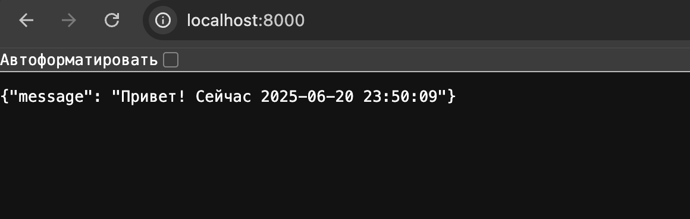
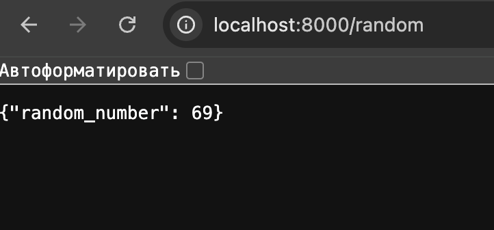
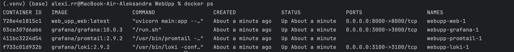
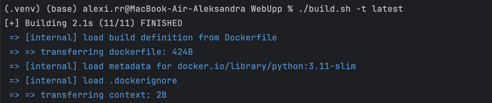
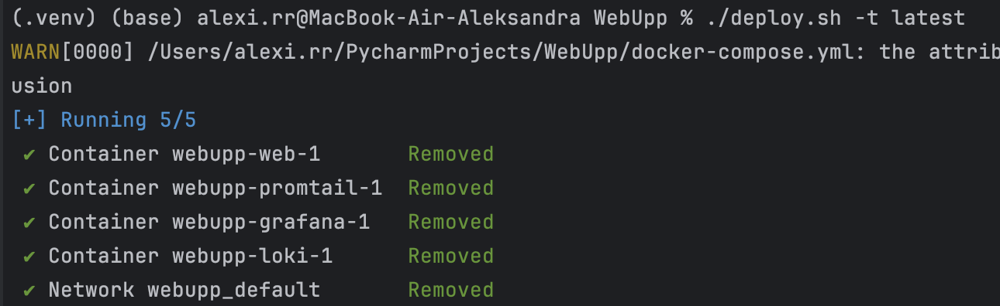
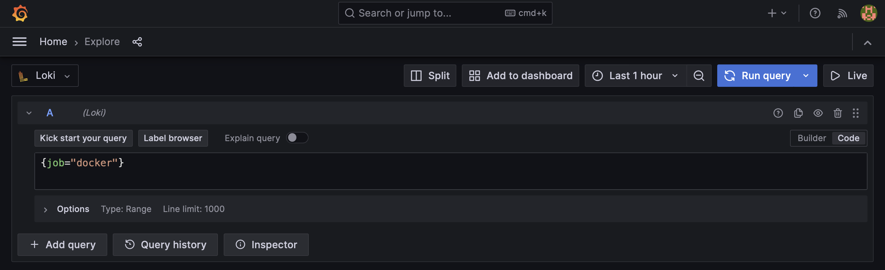
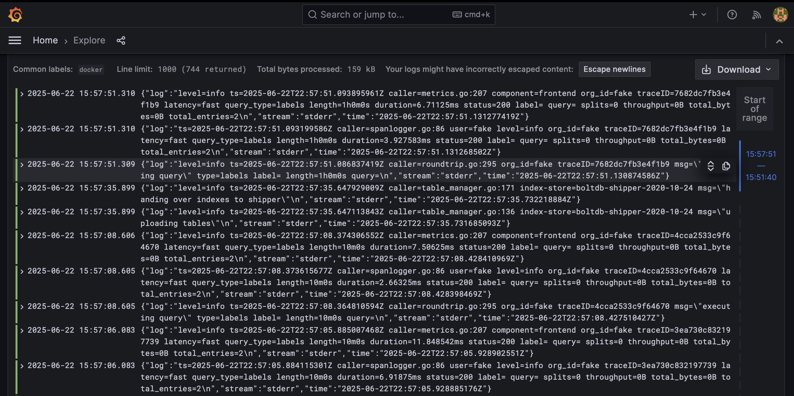
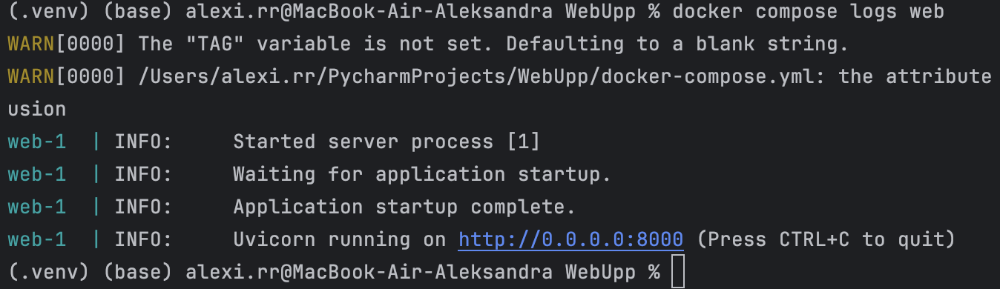

# WebUpp

## Описание

Небольшое FastAPI-приложение, которое:
- логирует обращения к эндпоинтам,
- отображает приветственное сообщение с текущим временем,
- возвращает случайное число по запросу.

## Запуск
```bash
chmod +x build.sh deploy.sh
```
```bash
./build.sh -t latest
```
```bash
./deploy.sh -t latest
```


### Работающее приложение

Приложение успешно запускается и отдаёт ответы:


по пути /random отображается рандомное число:

### Контейнеры работают
Контейнеры запускаются через Docker Compose и работают стабильно:


###  Bash-скрипты сборки и запуска
Сборка и запуск приложения выполняются через bash-скрипты build.sh и deploy.sh:





### Логирование в Grafana
Для централизованного логирования я настроил(а) связку Promtail → Loki → Grafana.
Логи FastAPI отправляются в Loki и отображаются в Grafana
На скриншотах видно, что система логирования работает корректно, Grafana отображает сообщения, полученные через Loki.



### Логирование на уровне терминала
Также логи доступны напрямую через команду:
```bash
docker compose logs
```

